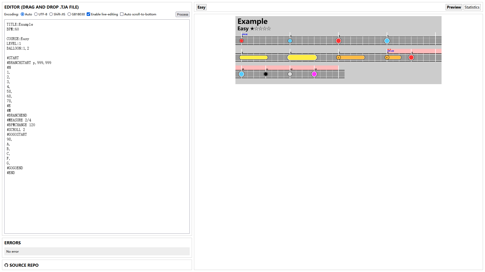

# TJA Tools

[日本語](README.md) [中文](README-CH.md) English

A tool to visualize `.tja` chart files. Forked from [Snack](https://github.com/Snack-X)'s [tja-tools](https://github.com/Snack-X/tja-tools).

## Run

Visit [https://whmhammer.github.io/tja-tools](https://whmhammer.github.io/tja-tools)

## Build

Install Node v14:

```
wget -qO- https://raw.githubusercontent.com/nvm-sh/nvm/v0.39.1/install.sh | bash
export NVM_DIR="$([ -z "${XDG_CONFIG_HOME-}" ] && printf %s "${HOME}/.nvm" || printf %s "${XDG_CONFIG_HOME}/nvm")"
[ -s "$NVM_DIR/nvm.sh" ] && \. "$NVM_DIR/nvm.sh"
nvm install 14.19.1
```

Clone the repo:

```
git clone https://github.com/WHMHammer/tja-tools
cd tja-tools
```

Install other dependencies:

```
npm install
```

Build:

```
npm run build
```

You shall then open `index.html` (not `src/index.html`) in your browser.

## Examples




## Progress

- [x] Manual Selection of file encoding
- [ ] Show different branches side-by-side
- Meta (common)
    - [x] `TITLE`
    - [ ] `SUBTITLE`
    - [x] `BPM`
    - [ ] `GENRE`
- Meta (course-specific)
    - `COURSE`
        - [x] `Easy` / `0`
        - [x] `Normal` / `1`
        - [x] `Hard` / `2`
        - [x] `Oni` / `3`
        - [x] `Edit` / `Ura` / `4`
        - [ ] `Tower` / `5`
        - [ ] `Dan` / `6`
    - [x] `LEVEL`
    - [x] `BALLOON`
    - [ ] `STYLE`
- Notes
    - [x] `0` (empty)
    - [x] `1` (Don)
    - [x] `2` (Ka)
    - [x] `3` (DON)
    - [x] `4` (KA)
    - [x] `5` (Drumroll starts)
    - [x] `6` (DRUMROLL starts)
    - [x] `7` (Balloon starts)
    - [x] `8` (drumroll/balloon ends)
    - [x] `9` (BALLOON starts)
    - [x] `A` (partner Don)
    - [x] `B` (partner Ka)
    - [x] `C` (Bomb)
    - [x] `F` (ADLIB)
    - [x] `G` (Green/Purple)
- Commands
    - [x] `#START`
    - [x] `#END`
    - [x] `#MEASURE`
    - [x] `#BPMCHANGE`
    - [ ] `#DELAY`
    - [x] `#SCROLL`
    - [x] `#GOGOSTART`
    - [x] `#GOGOEND`
    - [ ] `#BARLINEOFF`
    - [ ] `#BARLINEON`
    - [x] `#BRANCHSTART` (only the highest branch is displayed)
    - [x] `#N`
    - [x] `#E`
    - [x] `#M`
    - [x] `#BRANCHEND`
    - `#LYRIC`
    - [ ] `#LEVELHOLD`
    - [ ] `#NEXTSONG`

# Acknowledgement

- [Snack](https://github.com/Snack-X): The original author of the project
- [申しコミ](https://github.com/0auBSQ): Added support to `A`,`B`,`C`,`F`, and `G`notes
