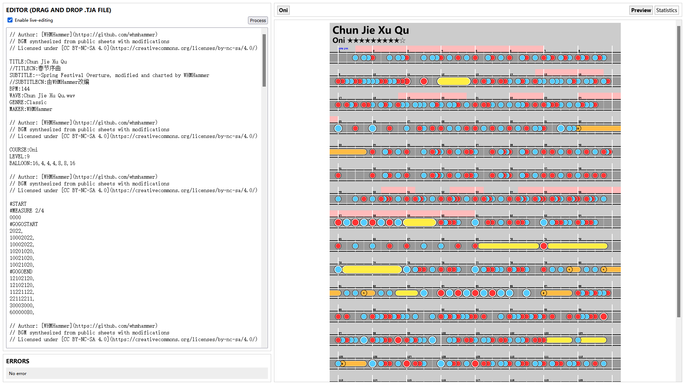
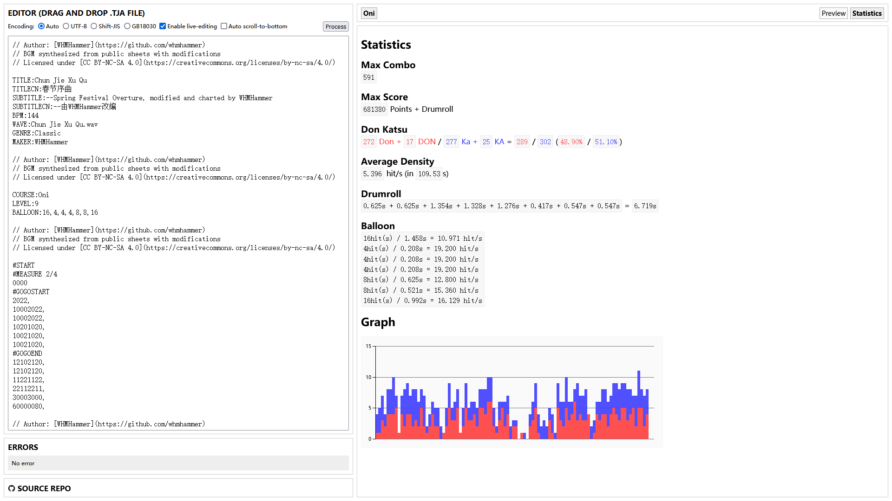

# TJA工具

中文 [English](README-EN.md)

将`.tja`文件转化为图片。由[Snack](https://github.com/Snack-X)的[tja-tools](https://github.com/Snack-X/tja-tools)分叉。

## 运行

访问[https://whmhammer.github.io/tja-tools](https://whmhammer.github.io/tja-tools)

## 构建

安装Node v14：

```
wget -qO- https://raw.githubusercontent.com/nvm-sh/nvm/v0.39.1/install.sh | bash
export NVM_DIR="$([ -z "${XDG_CONFIG_HOME-}" ] && printf %s "${HOME}/.nvm" || printf %s "${XDG_CONFIG_HOME}/nvm")"
[ -s "$NVM_DIR/nvm.sh" ] && \. "$NVM_DIR/nvm.sh"
nvm install 14.19.1
```

克隆代码库：

```
git clone https://github.com/WHMHammer/tja-tools
cd tja-tools
```

安装其它依赖：

```
npm install
```

构建：

```
npm run build
```

接着在浏览器中打开`index.html`（注意不是`src/index.html`）。

## 示例





## 进度

- [x] 自选文件编码
- [ ] 并列显示不同分歧轨道
- 全局元信息
    - [x] TITLE:
    - [x] SUBTITLE:
    - [x] BPM:
    - [x] WAVE:
    - [x] OFFSET:
    - [x] DEMOSTART:
    - [ ] SCOREMODE:
    - [x] GENRE:
    - [ ] STYLE:
- 各难度内部元信息
    - COURSE:
        - [x] Easy / 0
        - [x] Normal / 1
        - [x] Hard / 2
        - [x] Oni / 3
        - [x] Edit / Ura / 4
    - [x] LEVEL:
    - [x] BALLOON:
    - [x] SCOREINIT:
    - [x] SCOREDIFF:
- 指令
    - [x] #START
    - [x] #END
    - [x] #GOGOSTART
    - [x] #GOGOEND
    - [x] #MEASURE
    - [x] #SCROLL
    - [x] #BPMCHANGE
    - [ ] #DELAY
    - [x] #BRANCHSTART
    - [x] #BRANCHEND
    - [x] #N
    - [x] #E
    - [x] #M
    - [x] #LEVELHOLD
    - [ ] #BARLINEOFF
    - [ ] #BARLINEON
